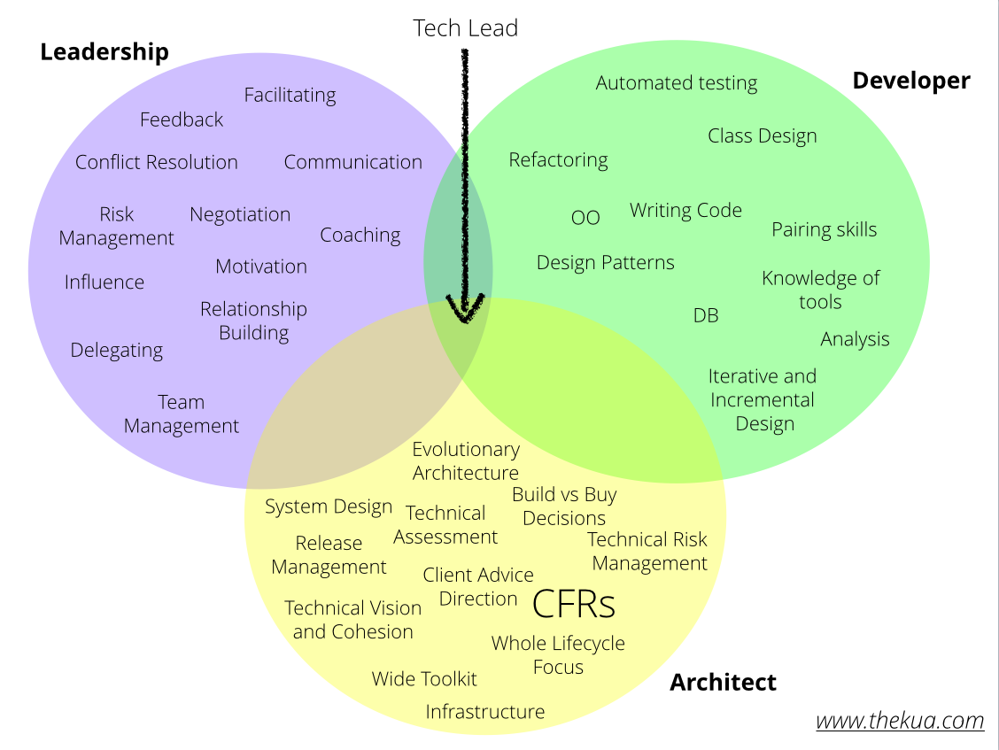
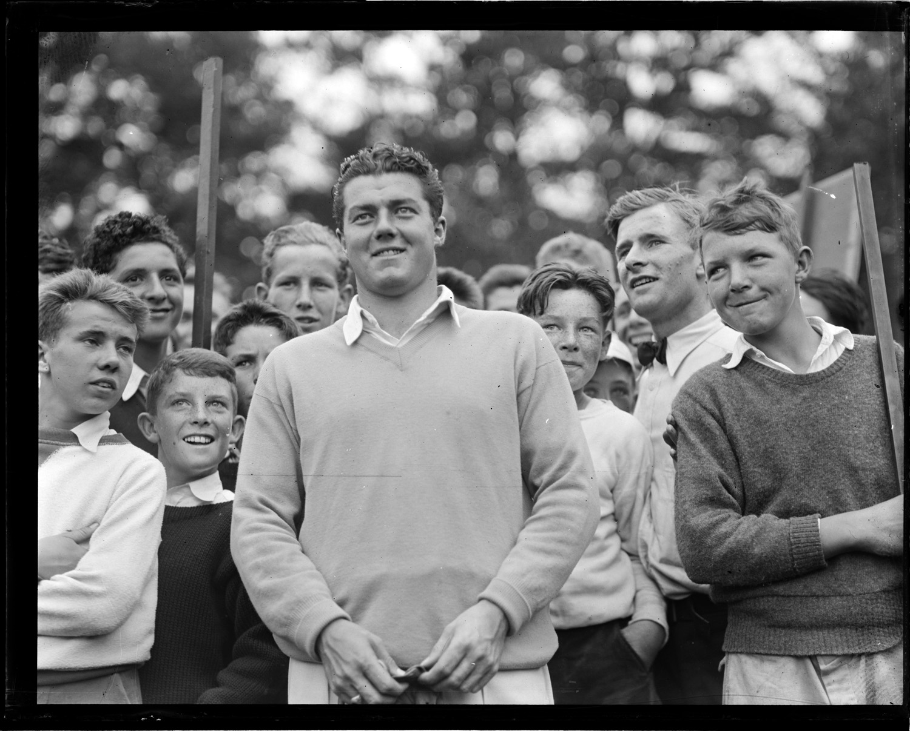
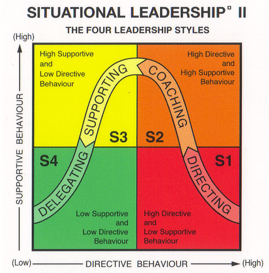

# Confessions of a Tech Lead

### *Joe Wright* 
#### __@joe_jag__

---


---

> Learn all you can from the mistakes of others. You won't have time to make them all yourself.
--Alfred Sheinwold

---


## What is a tech lead?

---



---


# Developer who<br> is a Leader

---


# Architect who<br> promotes the tech vision

---


# Leader who<br> builds systems

---



# People

---


# Situation #1
## *To code, or not to code...*

---


---

# Situation #2
## *I must choose one style to lead by*


---



---

> All models are wrong,<br> but some are useful.
-- George E. P. Box

---

# Situation #3
## *The standup confrontation*


---

> The realization that everyone is different when you talk to them alone is a secret to success in life.
--Scott Berkun

---

# Situation #4
## *The blinded pair*


---


---

# Situation #5
## *The Shiny thing*


---

> Creation and destruction are two sides of the same coin
-- Chuang Tzu


---

# Situation #6
## *The Grad decision*


---

>It depends
-- All consultants

---

# Situation #7
## *Forgetting about yourself*


---

# Code at least 30% of <br>the time. 


--- 

## Use a leadership style depending on the person.


--- 

## People are different when you speak to them alone.


---

## Ask questions, rather than make statements.


---

## Stanardisation helps productivity. <br>Too much kills innovation.


---

## Enthusiastic junior developers improve your team culture


---

## Remember to look <br>after yourself


---


---

> Wisdom comes from experience. Experience is often a result<br> of lack of wisdom.
--Terry Pratchett

---

# Image Attributions

```
Samantha Marx         (library)  flickr.com/photos/spam/5086168739
Hamed Saber            (desert)  flickr.com/photos/hamed/327939900
Pat Kua     (tech lead circles)  thekua.com/atwork/2015/06/tech-lead-circles-of-responsibility
Boston Public Library  (people)  flickr.com/photos/boston_public_library/6276242781
Rhys Davenport     (hamlet ape)  flickr.com/photos/33122834@N06/3601626998
tableatny               (baton)  flickr.com/photos/53370644@N06/4976497160
woodleywonderworks      (coach)  flickr.com/photos/wwworks/6320530955
Rob Swystun           (conduct)  flickr.com/photos/rob_swystun/8098008837
Noah                    (stare)  flickr.com/photos/noahbulgaria/565360029
Peter Mooney          (runners)  flickr.com/photos/peterm7/15225665855
Uditha Wickramanayaka    (time)  flickr.com/photos/126915310@N08/16704483331
USFWS Mountain-Prairie (magpie)  flickr.com/photos/usfwsmtnprairie/18612465062
Ken Douglas             (shiny)  flickr.com/photos/good_day/319849055
Ralph Daily          (gradaute)  flickr.com/photos/ralphandjenny/4612732045
Koen           (bear on tracks)  flickr.com/photos/d_oracle/350780566
stanley yuu            (statue)  flickr.com/photos/san25269644/12362983344
```

----

## What are your questions?

### *Joe Wright* 
### joe@joejag.com
### *@joe_jag*

