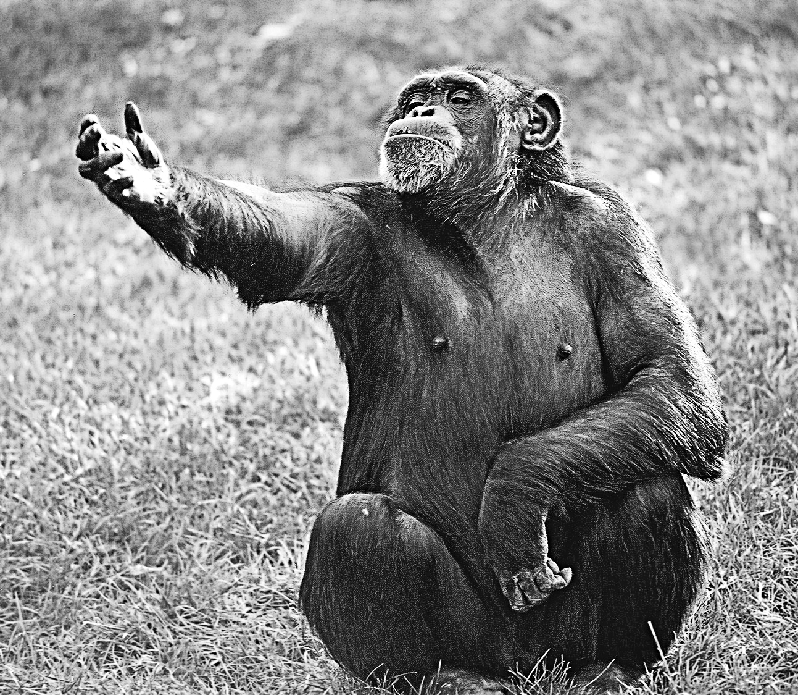
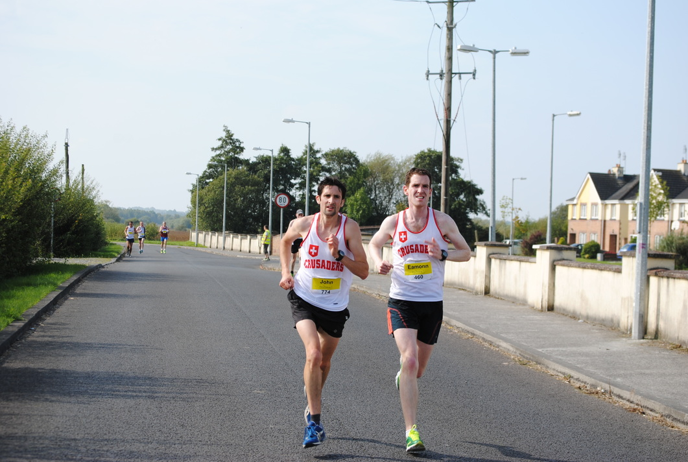
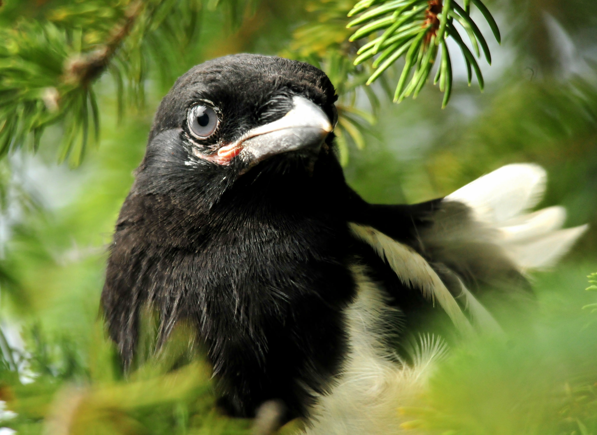
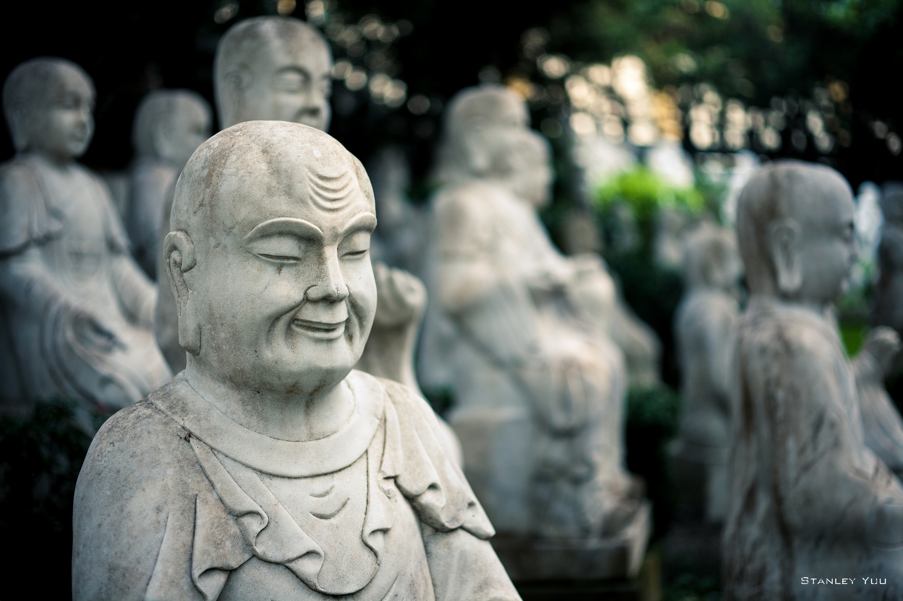

# Confessions of a <br>Tech Lead

### *Joe Wright*

---


---

> Learn all you can from the mistakes of others. You won't have time to make them all yourself.
--Alfred Sheinwold

---


## What is a tech lead?

---


---


- Engender the tech vision
- Champion cross functional attributes
- Build systems - not software

---


# People

---

> Wisdom comes from experience. Experience is often a result of lack of wisdom
--Terry Pratchett

---


# Situation #1
## *To code, or not to code...*

---


---

# Situation #2
## *I must choose one style to lead by*


---


---

# Situation #3
## *The group confrontation*


---

> The realization that everyone is different when you talk to them alone is a secret to success in life.
--Scott Berkun

---

# Situation #4
## *The blinded pair*



---

>Avoiding giant holes in the ground is better than climbing up mountains
-- Rob Lally

---

# Situation #4
## *The Shiny thing*




---

> Creation and destruction are two sides of the same coin
-- Chuang Tzu


---

# Situation #5
## *The Grad decision*


---
>It depends
-- All consultants


---

# Situation #6
## *Don't forget yourself*


---



---


# Image Attributions

```
Samantha Marx (library): flickr.com/photos/spam/5086168739
Hamed Saber (desert): flickr.com/photos/hamed/327939900
Pat Kua (tech lead circles): thekua.com/atwork/2015/06/tech-lead-circles-of-responsibility
Boston Public Library (people): flickr.com/photos/boston_public_library/6276242781
Rhys Davenport (hamlet ape): flickr.com/photos/33122834@N06/3601626998
tableatny (baton):  flickr.com/photos/53370644@N06/4976497160
woodleywonderworks (coach): flickr.com/photos/wwworks/6320530955
Rob Swystun (conduct): flickr.com/photos/rob_swystun/8098008837
Noah (stare): flickr.com/photos/noahbulgaria/565360029
Peter Mooney (runners): flickr.com/photos/peterm7/15225665855
USFWS Mountain-Prairie (magpie): flickr.com/photos/usfwsmtnprairie/18612465062
Ken Douglas (shiny): flickr.com/photos/good_day/319849055
Ralph Daily (gradaute): flickr.com/photos/ralphandjenny/4612732045
Koen (bear on tracks): flickr.com/photos/d_oracle/350780566
stanley yuu (statue): flickr.com/photos/san25269644/12362983344
```


